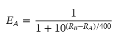

## Approach:

I will start from where I left off in the project. I have two columns which have Prerating and average for every player. Although my final table and dataframe skipped the column that has which player they played with, I still kept a data frame CombinedData that have the round information.\
\
I will use that infomation, so the formula of ELO calculation is (*Chessigma.com)*\
\

**R~A~** –\> player A's current rating\
**R~B~**--\> Player B's current rating\
**E~A~ –**\>Player A's expected score (a value between 0 and 1, where 1 means a certain win, 0.5 means an even match, and 0 means a certain loss\
\
I'll *mutate* and have a new column that'll have E~A~ and another column for R\`~A~ (new ratings, formula is given in bold next)\
\
It seems like the assignment wants us to get to the point to find the new rating for every user by\
\
***R\`~A~ = R~A~ + K(S~A~+ E~A~)\
***\
Usually people us K (K factor) to be 32 as default. the higher the K value, the faster the rating change. You chose higher K value for new player.

You can add options to executable code like this
